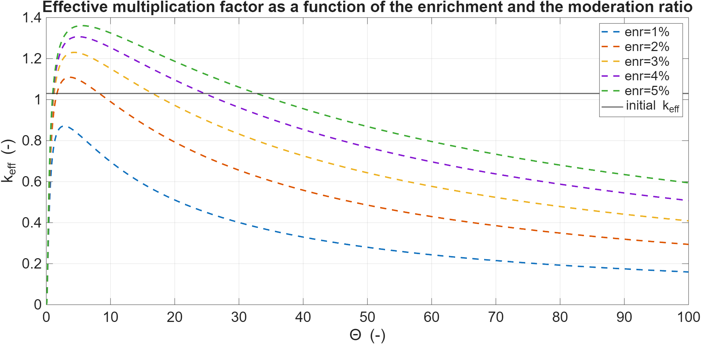
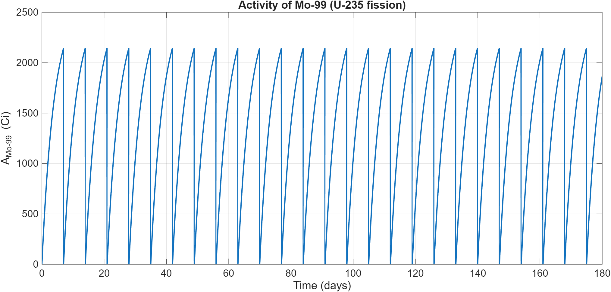

# Design of a homogeneous reactor for the production of radionuclides for medical purposes

This repository contains the MATLAB codes developed for my Bachelor's Thesis in Energy Engineering at **Politecnico di Torino** (Academic Year 2023-2024).

*   **Candidate:** Andrea Vair Piova
*   **Supervisor:** Prof. Sandra Dulla
*   **Co-supervisor:** Dr. Nicolò Abrate

---

## Project overview

The objective of this project is the neutronic design and fuel cycle analysis of a critical light-water cylindrical **Homogeneous Aqueous Solution Nuclear Reactor (HASNR)**. The reactor is optimized for the sustainable, weekly production of **Molybdenum-99 (${}^{99}\text{Mo}$)**, a key medical radioisotope widely used in diagnostic imaging (Tc-99m generators).

### Key reactor parameters (design output)

| Parameter | Value / Unit |
| :--- | :--- |
| **Reactor type** | Homogeneous Aqueous Solution (HASNR) |
| **Moderator / Coolant** | Light water ($\text{H}_2\text{O}$) |
| **Fuel** | Uranyl nitrate ($\text{UO}_2(\text{NO}_3)_2$) |
| **Fuel enrichment (${}^{235}\text{U}$)** | $3.0\text{ wt}\%$ (LEU) |
| **Thermal power** | $50\text{ kW}_{th}$ |
| **Optimal moderation ratio ($\Theta = N_m/N_f$)** | $1.2253$ (under-moderated core for intrinsic safety) |
| **Operating temperature** | $60^\circ\text{C}$ (at atmospheric pressure) |
| **Core dimensions** | Height: $100\text{ cm}$ \| Diameter: $100\text{ cm}$ |
| **Burnable neutron poison** | Gadolinium oxide ($\text{Gd}_2\text{O}_3$) |
| **Weekly ${}^{99}\text{Mo}$ production** | $\sim 471.4\text{ 6-day Ci}$ ($\sim 5\%$ of global demand) |

---

## Physical & numerical modeling

The simulation is split into two sequential phases across the MATLAB scripts:

### 1. Core criticality & parametric optimization
The code evaluates the infinite multiplication factor ($k_{\infty}$) and effective multiplication factor ($k_{eff}$) using:
*   **The four-factor formula:** computes $\eta$, $f$, $p$, and $\epsilon$ as a function of the moderation ratio $\Theta$ and fuel enrichment ($1\%$ to $5\%$).
*   **Westcott formalism:** applies temperature-dependent thermal cross-section corrections using Westcott $g$-factors at $60^\circ\text{C}$.
*   **Non-leakage probabilities ($P_{nl}$):** evaluates thermal and fast non-leakage utilizing a cylindrical geometric buckling ($B_g^2$) formulation.

### 2. Fuel cycle & activation kinetics (6-month burnup)
The depletion simulation tracks the isotopes ${}^{235}\text{U}$, ${}^{238}\text{U}$, ${}^{239}\text{Pu}$, and the activation product ${}^{99}\text{Mo}$ over a 180-day cycle:
*   **ODE solver (Forward Euler):** numerically integrates the transmutation and activation rate equations with a time step of $\Delta t = 1\text{ h}$.
*   **Criticality control (bisection method):** dynamically adjusts the concentration of the neutron absorber ($Gd_2O_3$) at each time step to maintain $k_{eff} = 1$ despite fuel depletion and Plutonium breeding.
*   **Weekly ${}^{99}\text{Mo}$ extraction:** simulates the chemical extraction of Molybdenum every 7 days, plotting the cyclic transient activity in Curie (Ci).

---

## File Guide

*   **`mod_ratio_and_enrichment_evaluation.m`**: script for the initial parametric study of moderation ratio ($\Theta$) and enrichment in the absence of poison. Generates plots for the four factors, $k_{\infty}$, and $k_{eff}$.
*   **`fuel_cycle_and_mo99_production.m`**: script simulating the 6-month operation cycle, poison burnable absorber control via non-linear bisection, and weekly ${}^{99}\text{Mo}$ extraction activity. The simulation is structured in two sequential phases: a continuous cycle without isotope removal, followed by a cycle with weekly ${}^{99}\text{Mo}$ extraction. The execution pauses between the two phases, requiring the user to press any key in the MATLAB Command Window to proceed to the extraction cycle. 

---

## Results and Visualizations

### Effective Multiplication Factor ($k_{eff}$) Optimization
The initial optimization is kept on the under-moderated side of the curve (left of the peak) to guarantee a negative temperature coefficient, ensuring intrinsic reactor safety.

 

### Weekly ${}^{99}\text{Mo}$ Production Activity
By implementing a 7-day extraction cycle, the reactor ensures a constant supply of molybdenum-99, producing approximately $471.4\text{ 6-day Ci}$ per week, and managing to complete 25 full cycles over a 6-month operating period.

---

## Academic References
1. **Lamarsh, J. R., Baratta, A. J.** *Introduction to Nuclear Engineering*. (Standard reference for the four-factor formula and neutronic parameters).
2. **Murray, R. L., Holbert, K. E.** *Nuclear Energy: An Introduction to the Concepts, Systems, and Applications of Nuclear Processes*. (Source for moderator properties and Fermi age data).
3. **IAEA TECDOC-1601** (2008). *Homogeneous Aqueous Solution Nuclear Reactors for the Production of Mo-99 and other Short Lived Radioisotopes*. (Technical reference for the Chinese MIPR reactor design used to scale this project's core dimensions).
4. **ENDF/B-VIII.0 Library via JANIS (NEA)**. (Source of the nuclear data and microscopic cross-sections used in the simulations).